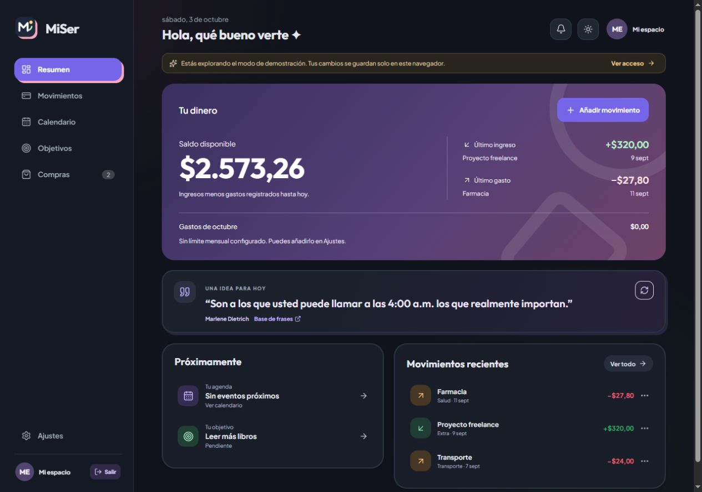
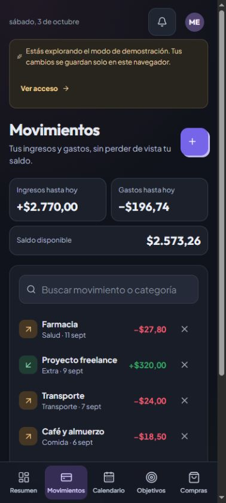
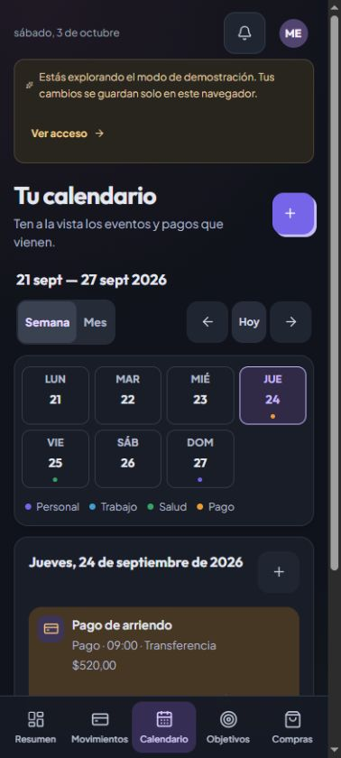
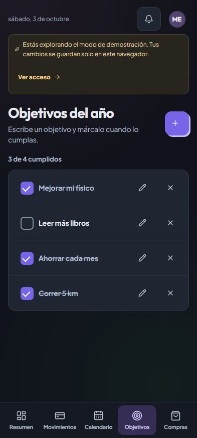
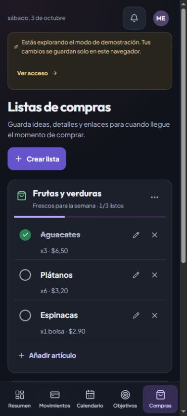

<p align="center">
  
</p>

<h1 align="center">MiSer</h1>

<p align="center">Tus finanzas y tus planes, con más calma.</p>

<p align="center">
  
  
  
  
  
  <a href="https://github.com/jacksonandresrosales/MiSer/releases/download/android-build-12/MiSer.apk"></a>
  <a href="https://github.com/jacksonandresrosales/MiSer/actions/workflows/build-apk.yml"></a>
</p>

<p align="center">
  <a href="#capturas">Capturas</a> ·
  <a href="#android">Android</a> ·
  <a href="#inicio-rápido">Inicio rápido</a> ·
  <a href="#configurar-firebase">Firebase</a> ·
  <a href="#contribuir">Contribuir</a>
</p>

MiSer reúne tu dinero y tus planes en un espacio personal: ingresos, gastos, presupuestos, calendario, objetivos del año y listas de compras. Está en español, se adapta a escritorio y teléfono y permite personalizar tu perfil.

Los movimientos se registran manualmente en **USD**. No necesitas conectar una cuenta bancaria para empezar.

## Qué puedes hacer

| Sección | Qué ofrece |
| --- | --- |
| **Resumen** | Saldo disponible hasta hoy, último ingreso en verde, último gasto en rojo, gastos del mes, próximos planes y una frase para el día. |
| **Movimientos** | Crear, editar, buscar y eliminar ingresos y gastos. Los movimientos futuros se muestran como programados y todavía no cuentan en el saldo. |
| **Presupuestos** | Configurar un límite mensual y límites por categoría. |
| **Calendario** | Organizar eventos y pagos con vistas semanal y mensual; en móvil, ver los siete días sin desplazamiento horizontal en la vista compacta. |
| **Objetivos del año** | Escribir un propósito y marcarlo cuando lo cumples, sin formularios complicados. |
| **Compras** | Crear listas y guardar cantidades, precios estimados, fotos y enlaces de artículos. |
| **Perfil y ajustes** | Cambiar el nombre visible y la foto, elegir tema claro u oscuro, pantalla de inicio y movimiento reducido. |
| **Datos y acceso** | Iniciar sesión con Google o correo/contraseña, sincronizar con Firebase y exportar una copia JSON. |
| **Android** | Navegación inferior, exportación con el diálogo nativo de compartir y búsqueda de nuevas versiones del APK. |

## Capturas

Capturas reales de la **interfaz web actual**, en escritorio y tamaño móvil, con datos de demostración. No contienen información de una cuenta personal. El APK de Capacitor comparte esta interfaz; los diálogos de Android no se muestran aquí.

### Resumen en escritorio



### Movimientos y calendario en móvil

<p align="center">
  <a href="docs/screenshots/movimientos-movil.jpg"></a>
  <a href="docs/screenshots/calendario-movil.jpg"></a>
</p>

### Objetivos y compras en móvil

<p align="center">
  <a href="docs/screenshots/objetivos-movil.jpg"></a>
  <a href="docs/screenshots/compras-movil.jpg"></a>
</p>

Pulsa una captura móvil para verla en su tamaño original.

## Android

### Descargar e instalar

El badge del inicio descarga directamente la **APK de pruebas 1.0.12**. Para encontrar versiones posteriores, consulta el [canal de la versión más reciente](https://github.com/jacksonandresrosales/MiSer/releases/tag/android-latest), cuya descripción enlaza al APK vigente.

1. Descarga `MiSer.apk` en un teléfono con **Android 7.0 o posterior**.
2. Abre el archivo y autoriza la instalación desde esa fuente si Android lo solicita.
3. Instálalo. Si ya tienes MiSer con la misma firma, actualiza encima: **no la desinstales**, para conservar los datos locales.

Las descargas incluyen un [checksum SHA-256](https://github.com/jacksonandresrosales/MiSer/releases/download/android-build-12/MiSer.apk.sha256). Estas compilaciones usan la firma de desarrollo estable del proyecto; no son una distribución de producción en Google Play.

### Actualizar desde la app

MiSer busca nuevas versiones al abrirse y al volver al primer plano. También puedes usar **Foto de perfil → Actualizaciones de MiSer → Buscar actualización**.

- Si existe una versión nueva, pulsa **Descargar e instalar** y confirma la instalación en Android.
- Para recibir avisos con la app cerrada, activa **Avisarme de nuevas versiones** y permite sus notificaciones.
- Los avisos comprueban cada **6 horas** con conexión. Android puede retrasarlos para ahorrar batería; no son notificaciones instantáneas al terminar GitHub.
- La descarga comienza solo cuando la pides. La app verifica paquete, versión, tamaño, hash y firma antes de abrir el instalador.

Más detalles y requisitos del canal: [Actualizaciones Android](docs/actualizaciones-android.md).

## Inicio rápido

### Requisitos

- **Node.js 24** y npm.
- Un navegador moderno.
- Firebase solo si quieres iniciar sesión y sincronizar datos.

### Probar la demostración

```bash
git clone https://github.com/jacksonandresrosales/MiSer.git
cd MiSer
npm ci
npm run dev
```

Abre la dirección que muestra Vite —normalmente [localhost:5173](http://localhost:5173)— y pulsa **Explorar demostración**.

Sin configuración de Firebase, la demostración funciona con almacenamiento local. Sus cambios permanecen en ese navegador y **no se sincronizan con una cuenta**. No hace falta instalar Android Studio para probar la web.

## Configurar Firebase

Para usar cuentas y guardar los datos en la nube:

1. Crea un proyecto de Firebase y registra una **aplicación web**.
2. Copia [.env.example](.env.example) a `.env.local`. En PowerShell:

   ```powershell
   Copy-Item .env.example .env.local
   ```

   En macOS o Linux:

   ```bash
   cp .env.example .env.local
   ```

3. Completa los seis valores con la configuración de tu aplicación web:

   ```dotenv
   VITE_FIREBASE_API_KEY=
   VITE_FIREBASE_AUTH_DOMAIN=
   VITE_FIREBASE_PROJECT_ID=
   VITE_FIREBASE_STORAGE_BUCKET=
   VITE_FIREBASE_MESSAGING_SENDER_ID=
   VITE_FIREBASE_APP_ID=
   ```

4. En **Authentication**, activa **Correo electrónico/contraseña** y **Google**. Añade `localhost` y el dominio de tu despliegue en **Configuración → Dominios autorizados**.
5. Crea **Cloud Firestore** y publica [firestore.rules](firestore.rules) en **Firestore Database → Reglas**.
6. Reinicia el servidor de desarrollo. Las reglas requieren una sesión válida, que el usuario sea el propietario de los registros y que su correo esté verificado.

La configuración web de Firebase se utiliza en el cliente y no es una credencial de administrador. **No incluyas cuentas de servicio, claves privadas, contraseñas ni claves de firma en el frontend o en Git.** `.env.local` está excluido del repositorio.

### Desplegar la web

La compilación de producción se genera en `dist/` con `npm run build`. En Vercel, utiliza ese comando y esa carpeta de salida; configura las seis variables `VITE_FIREBASE_*` y autoriza el dominio publicado en Firebase Authentication.

Si cambias las variables después de desplegar, genera un nuevo despliegue para que Vite las incorpore al cliente.

## Desarrollo y verificación

| Comando | Acción |
| --- | --- |
| `npm run dev` | Inicia el servidor local. |
| `npm test` | Ejecuta pruebas de datos, perfiles, caché, navegación, Google y publicación de actualizaciones. |
| `npm run lint` | Revisa el código con Oxlint. |
| `npm run build` | Comprueba TypeScript y genera `dist/`. |
| `npm run preview` | Sirve la compilación de producción localmente. |
| `npm run android:sync` | Copia el build web a Android y sincroniza los plugins de Capacitor. |

Para revisar un cambio antes de enviarlo:

```bash
npm test
npm run lint
npm run build
```

### Generar el APK en GitHub

El workflow [Build Android APK](.github/workflows/build-apk.yml) se ejecuta al cambiar `main`, salvo cambios exclusivamente en archivos Markdown o `.gitignore`. También puede iniciarse manualmente desde **Actions → Build Android APK → Run workflow**.

Comprueba la web y las reglas en un emulador, ejecuta pruebas Android, genera un APK **release** optimizado sin depuración y verifica Firebase/OAuth y la firma antes de publicar una release y actualizar el canal.

El workflow de este repositorio requiere:

- Añade las seis variables `VITE_FIREBASE_*` a **Settings → Secrets and variables → Actions** como variables o secretos; los secretos tienen prioridad.
- Conserva la clave privada existente en el secreto `ANDROID_DEBUG_KEYSTORE_BASE64` (el nombre se mantiene por compatibilidad). No la subas al repositorio ni la cambies entre actualizaciones.
- Registra la aplicación Android `com.miser.finanzas` en Firebase, añade la SHA-1 de esa firma y sustituye `android/app/google-services.json` por la configuración correspondiente a tu proyecto.
- Mantén el repositorio público para que el actualizador pueda consultar y descargar las releases sin un token dentro de la app.

Consulta [Actualizaciones Android](docs/actualizaciones-android.md) para la firma, publicación y comprobación en un dispositivo. No necesitas instalar el SDK Android en tu PC si compilas mediante GitHub Actions.

Si haces un **fork**, adapta primero el repositorio permitido en `scripts/publish-android.mjs` y las URLs/validaciones de `UpdateMetadata.java`: el canal actual está vinculado explícitamente a `jacksonandresrosales/MiSer`. Una copia no publica automáticamente en su propio canal.

## Datos, privacidad y alcance

Consulta [Seguridad, despliegue de reglas y rendimiento](docs/SECURITY.md) antes de activar App Check o sincronización incremental. Las reglas del repositorio deben publicarse en Firebase; el empaquetado no las despliega automáticamente.

- **Con cuenta:** Firestore guarda los registros en `finance_data/{uid}/records/{id}` y el perfil en `finance_data/{uid}`, bajo el usuario autenticado.
- **Android:** recuperación financiera cifrada mediante Android Keystore y bloqueo opcional con huella/PIN en Ajustes. Los backups del sistema están desactivados; los cambios pendientes no se eliminan al cerrar sesión.
- **Sin conexión:** después de una carga correcta, una copia local validada permite consultar y exportar datos. La edición se bloquea hasta reconectar. No es un modo de edición offline.
- **Demostración:** utiliza almacenamiento local independiente de la cuenta. No representa datos financieros reales.
- **Exportación:** la copia JSON incluye movimientos, eventos, objetivos, compras y presupuestos; no incluye el perfil. Guárdala en un lugar privado.
- **Recordatorios:** la campana muestra los próximos eventos marcados en la agenda; no envía notificaciones del sistema de esos eventos. Las notificaciones Android disponibles son las de **actualizaciones del APK**.
- **Frases:** Android rota frases incluidas en la app; la web puede consultar una API externa y dispone de frases de respaldo.
- **Alcance:** no se conectan bancos, no se realizan pagos y no se convierte entre monedas.

Si desinstalas la app o borras los datos del navegador, puedes perder la información almacenada únicamente en ese dispositivo. Exporta una copia antes de hacerlo.

## Estructura y tecnologías

La aplicación publicada utiliza **React 19, TypeScript 6, Vite 8, Firebase Authentication, Cloud Firestore, Lucide y Capacitor 8**.

```text
MiSer/
├── src/                        Interfaz React, lógica y pruebas
├── public/                     Logo y recursos estáticos
├── api/                        Endpoint de frases para la web
├── android/                    Proyecto Android de Capacitor
├── kotlin/                     Adaptación Kotlin en desarrollo
├── docs/                       Guías y capturas
├── scripts/                    Publicación y pruebas del canal Android
├── .github/workflows/          Compilación del APK
├── firestore.rules             Reglas de acceso
└── .env.example                Plantilla de configuración web
```

### Estado de Kotlin

[`kotlin/`](kotlin/README.md) contiene la primera etapa con **Kotlin Multiplatform y Compose Multiplatform**: resumen, movimientos y objetivos con almacenamiento local de demostración.

**No es el cliente que se descarga desde el badge.** La APK actual se genera desde React y Capacitor. La adaptación Kotlin todavía no inicia sesión ni sincroniza con Firebase; calendario, compras y presupuestos siguen en el cliente React.

## Contribuir

Antes de trabajar en un cambio, revisa los [issues](https://github.com/jacksonandresrosales/MiSer/issues) para evitar duplicados. Para reportar un fallo, indica la versión de MiSer, navegador o modelo de teléfono, pasos para reproducirlo y el resultado esperado; oculta cualquier dato personal en las capturas.

Para proponer código:

1. Crea una rama con un nombre descriptivo.
2. Mantén el cambio acotado y añade pruebas cuando afecte la lógica.
3. Ejecuta las comprobaciones de desarrollo y revisa móvil, escritorio y movimiento reducido si cambias la interfaz.
4. Abre un pull request explicando qué cambia y cómo lo verificaste.

Usa commits claros en español, por ejemplo: `fix(movil): corrige la distribución de los controles de ajustes`. Nunca adjuntes claves privadas ni información financiera personal.

## Licencia

Actualmente el repositorio no incluye un archivo `LICENSE`. No se declara una licencia de reutilización; consulta al [mantenedor](https://github.com/jacksonandresrosales) antes de redistribuir el proyecto.

## Documentación adicional

- [Mejoras y alcance de la adaptación móvil](docs/mejoras-moviles.md).
- [Instalación, seguridad y actualizaciones Android](docs/actualizaciones-android.md).
- [Endurecimiento, pruebas y configuración de Firebase](docs/SECURITY.md).
- [Adaptación Kotlin Multiplatform](kotlin/README.md).
- [Guía oficial de Vite en Vercel](https://vercel.com/docs/frameworks/frontend/vite).
